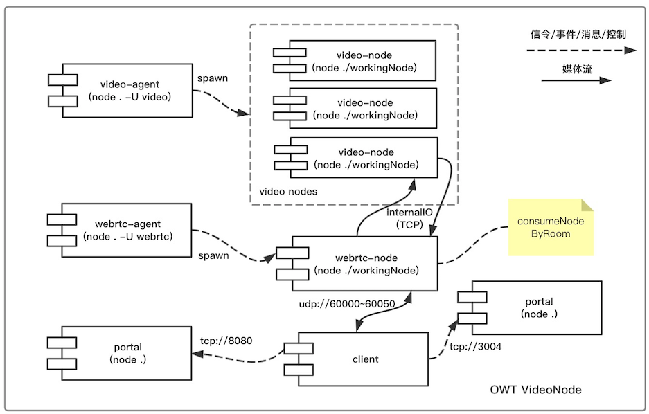

# Code Video

OWT的video是MCU对于视频的处理，关键是合流和视频转码。

* [Scripts](#scripts) 启动脚本，调试nodejs部分。
* [Heartbeat](#heartbeat) nodejs子进程和心跳消息。
* [Load Balancer](#load-balancer) nodejs子进程负载均衡。
* [Schedule](#schedule) 调度到video进程处理视频。
* [VideoNode](#videonode) video的处理流程，和webrtc-agent的通信，mixer和transcoder。
* [GDB Debug](#gdb-debug) 如何使用GDB调试C++代码。
* [VideoMixer In](#videomixer-in) mixer输入部分，从webrtc-agent读取数据，读取Frame，解码。
* [VideoMixer Out](#videomixer-out) mixer输出部分，合流，编码，输出到webrtc-agent。

## Scripts

启动服务的脚本`./dist/bin/start-all.sh`，它实际上调用了如下命令启动video：

```bash
./dist/bin/daemon.sh stop video-agent &&
cd dist/video_agent && export LD_LIBRARY_PATH=./lib && node . -U video
```

video实际上由多个c++的模块组成，它们运行在nodejs video这个进程：

```bash
./videoTranscoder_sw/build/Release/videoTranscoder-sw.node
./mediaFrameMulticaster/build/Release/mediaFrameMulticaster.node
./internalIO/build/Release/internalIO.node
./videoMixer_sw/build/Release/videoMixer-sw.node
```

这些c++导出的node文件（实际上就是动态库参考[CodeNodejs](CodeNodejs)），引用了其他的so，所以需要设置`LD_LIBRARY_PATH`，否则会出现这些库找不到：

```bash
owt-server-4.3/dist/video_agent# ldd ./videoMixer_sw/build/Release/videoMixer-sw.node
	libopenh264.so.4 => not found
	libavutil.so.56 => not found
	libavcodec.so.58 => not found
	libavformat.so.58 => not found
	libavfilter.so.7 => not found
	libSvtHevcEnc.so.1 => not found

owt-server-4.3/dist/video_agent# ldd ./internalIO/build/Release/internalIO.node
	libusrsctp.so.1 => not found

owt-server-4.3/dist/video_agent# ldd ./videoTranscoder_sw/build/Release/videoTranscoder-sw.node
	libopenh264.so.4 => not found
	libavutil.so.56 => not found
	libavcodec.so.58 => not found
	libavformat.so.58 => not found
	libavfilter.so.7 => not found
	libSvtHevcEnc.so.1 => not found

owt-server-4.3/dist/video_agent# ldd videoMixer_sw/build/Release/videoMixer-sw.node
	libopenh264.so.4 => not found
	libavutil.so.56 => not found
	libavcodec.so.58 => not found
	libavformat.so.58 => not found
	libavfilter.so.7 => not found
	libSvtHevcEnc.so.1 => not found
```

> Note: 这些库都在`dist/video_agent/lib`下面，设置正确的`LD_LIBRARY_PATH`后就可以找到这些so了。

和[CodeNodejs](CodeNodejs#nodejs)中分析的一样，后面nodeManager.js会启动多个node进程，这些进程会加载上面的c++模块，而这些模块我们可以单独调试。
我们快速跟踪下，以调试模式启动：

```bash
node inspect . -U vieo
```

然后设置断点`sb('index.js', 126)`并继续，会停留在初始化nodeManager的地方：

```bash
sb(126)
c
```

接着设置断点`sb('nodeManager.js', 67)`并继续，会停留在启动video子进程的地方：

```bash
sb('nodeManager.js', 67)
c
```

查看参数`exec spawnOptions.cmd`和`exec spawnArgs`可以看到参数。相当于执行以下命令启动了子进程：

```
node ./workingNode video-e5e222e2656c19b5caa9@172.17.0.2_0 \
video-e5e222e2656c19b5caa9@172.17.0.2 {"agent":{"maxProcesses":1,"prerunProcesses":1},\
"cluster":{"name":"owt-cluster","join_retry":60,"report_load_interval":1000,\
"max_load":0.85,"worker":{"ip":"172.17.0.2","join_retry":60,"load":\
{"max":0.85,"period":1000,"item":{"name":"cpu"}}}},"rabbit":{"host":"localhost",\
"port":5672},"internal":{"ip_address":"172.17.0.2","maxport":0,"minport":0},\
"video":{"hardwareAccelerated":false,"enableBetterHEVCQuality":false,"MFE_timeout":0,\
"codecs":{"decode":["vp8","vp9","h264","h265"],"encode":["vp8","vp9","h264_CB",\
"h264_B","h265"]}},"avatar":{"location":"avatars/avatar_blue.180x180.yuv"},\
"capacity":{"video":{"decode":["vp8","vp9","h264","h265"],"encode":["vp8","vp9",\
"h264_CB","h264_B","h265"]}},"purpose":"video"}
```

## Heartbeat

启动进程后，会接收进程的消息：

```
var child = spawn(spawnOptions.cmd, spawnArgs, {}
child.on('close', function (code, signal) {}
child.on('error', function (error) {}
child.on('message', function (message) {
    child.check_alive_interval = setInterval(function() {
    }, 3000);
}
```

> Note: 在message这个心跳消息中，会设置检查的interval，如果3秒没有心跳就认为子进程有问题了，会重新开子进程。

在子进程`workingNode.js`中，会调用`process.send`给父进程发消息，也就是上面的`message`回调函数：

```bash
process.send('READY');
setInterval(() => {
    process.send('IMOK');
}, 1000);
```

> Note: 连接到RabbitMQ后，就会给父进程发送`READY`消息，然后每隔1秒发送一条`IMOK`的心跳消息。

## Load Balancer

启动video-agent后，会加入集群，指定负载相关函数：

```bash
worker = clusterWorker({
    purpose: myPurpose, // video
    clusterName: config.cluster.name, // owt-cluster
    info: {
        ip: config.cluster.worker.ip, // 172.17.0.2
        max_load: config.cluster.worker.load.max, // 0.85
        capacity: config.capacity // video.decode['vp8','vp9','h264','h265'],
                                // video.encode['vp8','vp9','h264_CB','h264_B','h265']
    },
    onOverload: overload, // 不做什么
    loadCollection: config.cluster.worker.load // 定义在configLoader.js
});
```

负载的配置是在`configLoader.js`：

```js
config.cluster.worker.load = config.cluster.worker.load || {};
config.cluster.worker.load.max = config.cluster.max_load || 0.85;
config.cluster.worker.load.period = config.cluster.report_load_interval || 1000;
config.cluster.worker.load.item = {
  name: 'cpu'
};
```

可见，video的负载是以`cpu`为计算，每隔1秒汇报一次，最高负载0.85。

## Schedule

video-agent通过RabbitMQ接收任务，定义在`index.js`中：

```
var rpcAPI = function (worker) {
    return {
        getNode: function(task, callback) {
          if (manager) {
            return manager.getNode(task).then((nodeId) => {
              callback('callback', nodeId);
```

它调用了`nodeManager.js`中的获取进程的函数：

```
that.getNode = (task) => {
    // room: '5e630faec04d6863f75db2d4', task: '98295945257153838348'
    if (spec.consumeNodeByRoom) { // false
    } else {
      getByRoom = Promise.reject('Not found');
    }

return getByRoom
  .then((foundOne) => {
    return foundOne;
  }, (notFound) => {
    return pickInIdle(); // 没有找到，就找一个空闲的
  })
  .then((nodeId) => {
    return waitTillNodeReady(nodeId, 1500/*FIXME: Use a more reasonable timeout value instead of hard coding*/);
  }).then((nodeId) => {
    addTask(nodeId, task);
    return nodeId;
  });
};
```

由于video并不是按房间(consumeNodeByRoom)调度的，所以会找一个空闲的`pickInIdle`：

```
  let pickInIdle = () => {
    return new Promise((resolve, reject) => {
      let node_id = idle_nodes.shift();
      nodes.push(node_id);
      setTimeout(() => {
        if ((spec.maxNodeNum < 0) || ((nodes.length + idle_nodes.length) < spec.maxNodeNum)) {
          fillNodes();
        } else if (spec.reuseNode) { // false
          idle_nodes.push(nodes.shift());
        }
      }, 0);

      resolve(node_id); // video-eed09f68e5bc1a5ff382@172.17.0.2_1
    });
  };
```

这里会把目前空闲的video返回，然后重新开启一个新的video进程（若还没达到maxNodeNum上限）。

```
2020-03-07 03:54:40.466  - DEBUG: AmqpClient - New message received { method: 'getNode',
  args:
   [ { room: '5e631598824dfb04091f1e59',
       task: '72122114062012276925' } ],
  corrID: 4,
  replyTo: 'amq.gen-LWAiGFWFEBtxk9tdTJZoLA' }
2020-03-07 03:54:40.467  - DEBUG: NodeManager - getNode, task: { room: '5e631598824dfb04091f1e59',
  task: '72122114062012276925' }
2020-03-07 03:54:40.471  - DEBUG: NodeManager - not found existing node
2020-03-07 03:54:40.473  - DEBUG: NodeManager - got nodeId: video-d683f43dffd8b4faf936@172.17.0.2_0
2020-03-07 03:54:40.475  - DEBUG: NodeManager - node video-d683f43dffd8b4faf936@172.17.0.2_0 is ready
2020-03-07 03:54:40.494  - DEBUG: NodeManager - launchNode, id: video-d683f43dffd8b4faf936@172.17.0.2_1
```

> Note: MCU模式下，第一个人进来订阅的就已经是video转码的流，第二个人进来订阅的同样的流，所以不会再启动一个video转一次码。

## VideoNode



上面分析了调度过程，最终一个task分配到video node后，我们可以开启video-agent的日志来看这个过程：

```
# vi dist/video_agent/log4js_configuration.json + 18
    "LayoutProcessor": "DEBUG",
    "VideoNode": "DEBUG",
```

启动时，video node进程打开的文件如下：

```
root@e6831daf9453:/tmp/git/owt-docker/owt-server-4.3# lsof -p 1139
COMMAND  PID USER   FD      TYPE             DEVICE SIZE/OFF       NODE NAME
node    1139 root  cwd       DIR               0,80     1184 8638807168 /tmp/git/owt-docker/owt-server-4.3/dist/video_agent
node    1139 root    0r      CHR                1,3      0t0    1683075 /dev/null
node    1139 root    1w      REG               0,80      568 8639223308 /tmp/git/owt-docker/owt-server-4.3/dist/logs/video-308f3fc586f3c6cd8873@172.17.0.2_0.log
node    1139 root    2w      REG               0,80      568 8639223308 /tmp/git/owt-docker/owt-server-4.3/dist/logs/video-308f3fc586f3c6cd8873@172.17.0.2_0.log
node    1139 root    3u     unix 0x0000000000000000      0t0    1685628 type=STREAM
node    1139 root    4u  a_inode               0,13        0      12074 [eventpoll]
node    1139 root    5r     FIFO               0,12      0t0    1686612 pipe
node    1139 root    6w     FIFO               0,12      0t0    1686612 pipe
node    1139 root    7r     FIFO               0,12      0t0    1686613 pipe
node    1139 root    8w     FIFO               0,12      0t0    1686613 pipe
node    1139 root    9u  a_inode               0,13        0      12074 [eventfd]
node    1139 root   10r      CHR                1,3      0t0    1683075 /dev/null
node    1139 root   11u     IPv4            1687667      0t0        TCP localhost:38670->localhost:amqp (ESTABLISHED)
```

> Note: 0,1,2是标准输入输出，定向到了日志文件。11是和RabbitMQ建立的TCP连接。

这样第一个人进入房间时，就会启动video node的进程，日志如下：

```
####### vi dist/video_agent/video/index.js +361
2020-03-07 04:14:36.116  - DEBUG: VideoNode - initEngine, videoConfig: {"layout":{"templates":[{"region":[{"id":"1"...
####### vi source/agent/video/videoMixer/VideoMixer.cpp +66
2020-03-07 04:14:36,124  - INFO: mcu.media.VideoMixer - Init maxInput(16), rootSize(640, 480), bgColor(16, 128, 128)
####### vi dist/video_agent/video/index.js +403
2020-03-07 04:14:36.128  - DEBUG: VideoNode - Video engine init OK, supported_codecs: { decode: [ 'vp8', 'vp9', 'h264', 'h265' ],
  encode: [ 'vp8', 'vp9', 'h264_CB', 'h264_B', 'h265' ] }

2020-03-07 04:14:36.329  - DEBUG: VideoNode - generate, codec: vp8 resolution: { height: 480, width: 640 } framerate: 24 bitrate: unspecified keyFrameInterval: 100
2020-03-07 04:14:36.335  - DEBUG: VideoNode - addOutput: codec vp8 resolution: { height: 480, width: 640 } framerate: 24 bitrate: 665.5999999999999 keyFrameInterval: 100
2020-03-07 04:14:36.358  - DEBUG: VideoNode - addOutput ok, stream_id: 846206823613141500

2020-03-07 04:14:36.408  - DEBUG: VideoNode - subscribe, connectionId: 846206823613141500@webrtc-799819c55bf3c48359a0@172.17.0.2_0 connectionType: internal options: { controller: 'conference-c281c7e712053a6e671c@172.17.0.2_8',
  ip: '172.17.0.2',
  port: 45201 }
2020-03-07 04:14:36.424  - DEBUG: VideoNode - linkup, connectionId: 846206823613141500@webrtc-799819c55bf3c48359a0@172.17.0.2_0 video_stream_id: 846206823613141500
2020-03-07 04:14:36.434  - DEBUG: VideoNode - forceKeyFrame, stream_id: 846206823613141500

2020-03-07 04:14:37.076  - DEBUG: VideoNode - publish, stream_id: 381316705155855500 stream_type: internal options: { controller: 'conference-c281c7e712053a6e671c@172.17.0.2_8',
  publisher: 'RWxUX5bGzGfl3IocAAAN',
  audio: false,
  video: { codec: 'vp8' },
  ip: '172.17.0.2',
  port: 0 }
2020-03-07 04:14:37.079  - DEBUG: VideoNode - publish 1, inputs.length: 0 maxInputNum: 16
2020-03-07 04:14:37.081  - DEBUG: VideoNode - add input 381316705155855500
2020-03-07 04:14:37.092  - DEBUG: VideoNode - layoutChange [ { input: 0,
    region: Region { id: '1', shape: 'rectangle', area: [Object] } } ]
2020-03-07 04:14:37.105  - DEBUG: VideoNode - addInput ok, stream_id: 381316705155855500 codec: vp8 options: { controller: 'conference-c281c7e712053a6e671c@172.17.0.2_8',
  publisher: 'RWxUX5bGzGfl3IocAAAN',
  audio: false,
  video: { codec: 'vp8' },
  ip: '172.17.0.2',
  port: 0 }
```

同时，还会和webrtc-agent建立TCP连接，传输数据：

```
root@e6831daf9453:/tmp/git/owt-docker/owt-server-4.3# lsof -p 1139
COMMAND  PID USER   FD      TYPE             DEVICE SIZE/OFF       NODE NAME
node    1139 root   24u     IPv4            1732369      0t0        TCP e6831daf9453:46560->e6831daf9453:42979 (ESTABLISHED)
node    1139 root   28u     IPv4            1735017      0t0        TCP *:42003 (LISTEN)
node    1139 root   29u     IPv4            1733908      0t0        TCP e6831daf9453:42003->e6831daf9453:43630 (ESTABLISHED)

root@e6831daf9453:/tmp/git/owt-docker/owt-server-4.3# netstat -anp|grep 42979
tcp        0      0 0.0.0.0:42979           0.0.0.0:*               LISTEN      1539/node
tcp        0      0 172.17.0.2:46560        172.17.0.2:42979        ESTABLISHED 1139/node
tcp        0      0 172.17.0.2:42979        172.17.0.2:46560        ESTABLISHED 1539/node

root@e6831daf9453:/tmp/git/owt-docker/owt-server-4.3# netstat -anp|grep 42003
tcp        0      0 0.0.0.0:42003           0.0.0.0:*               LISTEN      1139/node
tcp        0      0 172.17.0.2:42003        172.17.0.2:43630        ESTABLISHED 1139/node
tcp        0      0 172.17.0.2:43630        172.17.0.2:42003        ESTABLISHED 1539/node

root@e6831daf9453:/tmp/git/owt-docker/owt-server-4.3# ps aux|grep 1539
root      1539  7.0  2.9 3079952 59228 ?       Ssl  05:02   1:09 node ./workingNode webrtc-cd8145aa9503b6c79d39@172.17.0.2_0
```

> Note: webrtc(PID=1539,PORT=42979)侦听了这个端口，video(PID=1139,PORT=46560)连接到了这个端口。video从webrtc取第一个人推上来的流。

> Note: video(PID=1139,PORT=42003)侦听了端口，webrtc(PID=1539,PORT=43630)连接到了这个端口。webrtc从video取合并的流。

> Note: `roomController.js`的函数getVideoStream中，会判断是调用mixer还是transcoder，然后给video-agent发送消息。

第二个人进入房间时，这个video node会订阅它的流并合并：

```
2020-03-07 04:20:07.411  - DEBUG: VideoNode - generate, codec: vp8 resolution: { height: 480, width: 640 } framerate: 24 bitrate: unspecified keyFrameInterval: 100
2020-03-07 04:20:07.527  - DEBUG: VideoNode - forceKeyFrame, stream_id: 846206823613141500

2020-03-07 04:20:07.952  - DEBUG: VideoNode - publish, stream_id: 658664324543501000 stream_type: internal options: { controller: 'conference-c281c7e712053a6e671c@172.17.0.2_8',
  publisher: 'J-keGdJVYxNGzdSPAAAO',
  audio: false,
  video: { codec: 'vp8' },
  ip: '172.17.0.2',
  port: 0 }
2020-03-07 04:20:07.956  - DEBUG: VideoNode - publish 1, inputs.length: 1 maxInputNum: 16
2020-03-07 04:20:07.986  - DEBUG: VideoNode - add input 658664324543501000
2020-03-07 04:20:08.038  - DEBUG: VideoNode - layoutChange [ { input: 0,
    region: Region { id: '1', shape: 'rectangle', area: [Object] } },
  { input: 1,
    region: Region { id: '2', shape: 'rectangle', area: [Object] } },
  { region: Region { id: '3', shape: 'rectangle', area: [Object] } },
  { region: Region { id: '4', shape: 'rectangle', area: [Object] } } ]
2020-03-07 04:20:08.090  - DEBUG: VideoNode - addInput ok, stream_id: 658664324543501000 codec: vp8 options: { controller: 'conference-c281c7e712053a6e671c@172.17.0.2_8',
  publisher: 'J-keGdJVYxNGzdSPAAAO',
  audio: false,
  video: { codec: 'vp8' },
  ip: '172.17.0.2',
  port: 0 }
```

查看TCP连接的变化：

```
node    1139 root   33u     IPv4            1749431      0t0        TCP *:38291 (LISTEN)
node    1139 root   34u     IPv4            1748334      0t0        TCP e6831daf9453:38291->e6831daf9453:56992 (ESTABLISHED)

root@e6831daf9453:/tmp/git/owt-docker/owt-server-4.3# netstat -anp|grep 38291
tcp        0      0 0.0.0.0:38291           0.0.0.0:*               LISTEN      1139/node
tcp        0      0 172.17.0.2:56992        172.17.0.2:38291        ESTABLISHED 1539/node
tcp        0      0 172.17.0.2:38291        172.17.0.2:56992        ESTABLISHED 1139/node
```

> Note: video(PID=1139,PORT=38291)侦听了端口，webrtc(PID=1539,PORT=56992)连接到了这个端口。webrtc从video取合并的流，每个人的流都会从video取一次。

MCU有三种工作方式：

```
# vi dist/conference_agent/roomController.js +1223
var getVideoStream = function (stream_id, format, resolution, framerate, bitrate, keyFrameInterval, simulcastRid, on_ok, on_error) {
    var mixView = getViewOfMixStream(stream_id);
    if (mixView) {
        getMixedVideo(mixView, format, resolution, framerate, bitrate, keyFrameInterval, function (streamID) {}
    } else if (streams[stream_id]) {
        if (streams[stream_id].video) {
            if (isSimulcastStream(stream_id)) {
                const matchedSimId = simulcastVideoMatched(stream_id, format, resolution, framerate, bitrate, keyFrameInterval, simulcastRid);
            } else if (isVideoMatched(videoInfo, format, resolution, framerate, bitrate, keyFrameInterval)) {
                on_ok(stream_id);
            } else {
                getTranscodedVideo(format, resolution, framerate, bitrate, keyFrameInterval, stream_id, function (streamID) {}
```

* `mixer`，混流模式，默认的页面进来是这种模式，流是混在一起的，在页面选择不同的分辨率会转成不同的输出的流。
* `transcoder`，转码模式，页面如果带了`?forward=true`参数，也就是转发每路流（不混流）模式，选择不同的分辨率时就会启动转码。
* `simulcast`，编码时会编出多层流，这样服务器可以不编码，SFU就能输出不同的码流了，需要开启支持，详细的还需要再看看。

## GDB Debug

使用debug镜像启动OWT：

```bash
HostIP=`ifconfig en0 inet| grep inet|awk '{print $2}'` &&
docker run -it -p 3004:3004 -p 3300:3300 -p 8080:8080 -p 60000-60050:60000-60050/udp \
    --privileged --env DOCKER_HOST=$HostIP \
    registry.cn-hangzhou.aliyuncs.com/ossrs/owt:debug bash
```

> Note: 也可以挂载目录，或使用你自己的OWT(需要修改一些配置)，具体参考[Deubg](https://github.com/winlinvip/owt-docker#debug)。

启动OWT服务：

```bash
(cd dist && ./bin/init-all.sh && ./bin/start-all.sh)
```

启动GDB调试，并Attach调试Video Agent的进程：

```bash
./dist/bin/daemon.sh stop video-agent &&
./dist/bin/daemon.sh start video-agent && sleep 3 &&
gdb --pid `ps aux|grep video|grep workingNode|awk '{print $2}'`
```

设置断点，并继续运行：

```bash
b mcu::VideoMixer::addInput
c
```

打开页面进入房间，就会命中断点：

```bash
(gdb) bt
#0  mcu::VideoMixer::addInput (this=0x56452e1bcb90, inputIndex=1, codec="vp8", source=0x56452e224e30 at ../../VideoMixer.cpp:82
#1  0x00007f8c84ea3802 in VideoMixer::addInput (args=...) at ../../VideoMixerWrapper.cc:100
#2  0x000056452c00dd0f in v8::internal::FunctionCallbackArguments::Call(void (*)(v8::FunctionCallbackInfo<v8::Value> const&)) ()
```

> Note: 当然打印日志，也可以看到模块的输入输出。

## VideoMixer: in

我们调试下mixer的工作过程，MCU是默认模式，会使用mixer合流。
先看in的过程，也就是从webr-agent读取包，并合流的过程。

第一个用户进入房间时，就会进入的构造函数：

```
(gdb) b mcu::VideoMixer::VideoMixer
(gdb) c

// vi source/agent/video/videoMixer/VideoMixer.cpp +23
// VideoMixer::VideoMixer(const VideoMixerConfig& config)

(gdb) p config
$1 = (const mcu::VideoMixerConfig &) {maxInput = 16, crop = false, resolution = "vga",
    bgColor = {r = 0, g = 0, b = 0}, useGacc = false,  MFE_timeout = 0}

// ["vga"] = {width = 640, height = 480}
// if (!VideoResolutionHelper::getVideoSize(config.resolution, rootSize)) {}
(gdb) p rootSize
$4 = {width = 640, height = 480}

(gdb) p bgColor
$6 = {y = 16 '\020', cb = 128 '\200', cr = 128 '\200'}

// m_frameMixer.reset(new VideoFrameMixerImpl
// m_compositor.reset(new SoftVideoCompositor
// input.reset(new SoftInput
// m_avatarManager.reset(new AvatarManager
// m_generators[0].reset(new SoftFrameGenerator
```

* 创建`VideoFrameMixerImpl`对象，会判断使用了软件编码，所以创建`SoftVideoCompositor`对象。
* 配置限定了最多合并16个视频(input)，每个input会创建一个`SoftInput`，它还会创建`FrameConverter`转换帧。
* 创建两个generators，是根据fps创建的，一个是6到48帧，一个是15到60帧，它们会启动不同间隔的定时器。

这时还只初始化了对象，还没有开始拉流。后面就会创建`InConnection`对象，它包装了`internalIO.node`的c++对象：

```
# vi dist/video_agent/video/index.js +217
var addInput = function (stream_id, codec, options, avatar, on_ok, on_error) {
    var conn = internalConnFactory.fetch(stream_id, 'in');
    conn.connect(options);
        if (engine.addInput(inputId, codec, conn, avatar)) {

# vi dist/video_agent/video/InternalConnectionFactory.js +35
var internalIO = require('../internalIO/build/Release/internalIO');
var InternalIn = internalIO.In;
function InConnection(prot, minport, maxport) {
    switch (prot) {
        case 'tcp':
        case 'udp':
            conn = new InternalIn(prot, minport, maxport);

# vi source/agent/addons/internalIO/InternalInWrapper.cc +46
void InternalIn::New(const FunctionCallbackInfo<Value>& args) {
  InternalIn* obj = new InternalIn();

# vi source/core/owt_base/InternalIn.cpp +12
InternalIn::InternalIn(const std::string& protocol, unsigned int minPort, unsigned int maxPort) {
    if (protocol == "tcp")
        m_transport.reset(new owt_base::RawTransport<TCP>(this));

# vi source/agent/addons/internalIO/InternalInWrapper.h +17
class InternalIn : public FrameSource {
```

> Note: `minport`是定义在`dist/video_agent/video/index.js:453`，也就是配置文件的internal部分的端口配置，内部传输的端口范围。

> Remark: 注意`InternalIn`是继承了`FrameSource`，在JS创建的是`InternalIn`，而在VideoMixer中转换的参数是`FrameSource`，取的是基类。

我们可以设置断点，在连接webrtc-agent的地方：

```
(gdb) b RawTransport.cpp:114
(gdb) c

# vi source/core/owt_base/RawTransport.cpp +114
void RawTransport<prot>::connectHandler(const boost::system::error_code& ec) {
    case TCP:
        m_socket.tcp.socket->set_option(tcp::no_delay(true));

# vi source/core/owt_base/RawTransport.cpp +542
void RawTransport<prot>::receiveData() {
    m_receiveData.buffer.reset(new char[m_bufferSize]); // m_bufferSize=1600
    if (m_tag) {
        m_socket.tcp.socket->async_read_some(boost::asio::buffer(m_readHeader, 4),
            boost::bind(&RawTransport::readHandler, this,
                boost::asio::placeholders::error,
                boost::asio::placeholders::bytes_transferred));

(gdb) p/x m_readHeader
$16 = {0x0, 0x0, 0x0, 0x8d} // 0x8d=141

# vi source/core/owt_base/RawTransport.cpp +301
void RawTransport<prot>::readHandler(const boost::system::error_code& ec, std::size_t bytes)
    // 下面是各种异步的读写，由于不知道读了多少，所以就非常的费劲。
    if (4 > m_receivedBytes) {
        m_socket.tcp.socket->async_read_some(boost::asio::buffer(m_readHeader + m_receivedBytes, 4 - m_receivedBytes),
                boost::bind(&RawTransport::readHandler, this,
    } else {
        payloadlen = ntohl(*(reinterpret_cast<uint32_t*>(m_readHeader)));
        if (payloadlen > m_bufferSize) {
            m_bufferSize = ((payloadlen * BUFFER_EXPANSION_MULTIPLIER + BUFFER_ALIGNMENT - 1) / BUFFER_ALIGNMENT) * BUFFER_ALIGNMENT;
        }
        m_receivedBytes = 0;
        m_socket.tcp.socket->async_read_some(boost::asio::buffer(m_receiveData.buffer.get(), payloadlen),
            boost::bind(&RawTransport::readPacketHandler, this,
    }

# vi source/core/owt_base/RawTransport.cpp +370
void RawTransport<prot>::readPacketHandler(const boost::system::error_code& ec, std::size_t bytes)
(gdb) b RawTransport.cpp:388
(gdb) c
# 可以看到收到的第一个包。
(gdb) p m_receivedBytes
$1 = 141
```

> Note: 连接到webrtc-agent后，开辟了一个1600字节的缓冲区，不断读取数据。

> Note: `m_tag`设置为true（默认为true）时，会有个4字节的头，读取到m_readHeader字段，比如141字节。

这时候，和webrtc-agent的通道已经建立好了，对于video来说是`in`也就是输入的：

```bash
root@8c3e5cff0312:/tmp/git/owt-docker/owt-server-4.3# ps aux|grep video|grep workingNode
root     28863  0.2  2.9 1877980 60652 ?       tsl  12:51   0:01 node ./workingNode video-8824ee00613afb706a34@172.17.0.2_0

root@8c3e5cff0312:/tmp/git/owt-docker/owt-server-4.3# lsof -p 35653 |grep TCP
node    35653 root   24u     IPv4             983691      0t0        TCP 8c3e5cff0312:55388->8c3e5cff0312:44029 (ESTABLISHED)

root@8c3e5cff0312:/tmp/git/owt-docker/owt-server-4.3# netstat -anp|grep 44029
tcp        0      0 0.0.0.0:44029           0.0.0.0:*               LISTEN      1125/node
tcp        0      0 172.17.0.2:44029        172.17.0.2:55388        ESTABLISHED 1125/node
tcp      290      0 172.17.0.2:55388        172.17.0.2:44029        ESTABLISHED 35653/node

root@8c3e5cff0312:/tmp/git/owt-docker/owt-server-4.3# ps aux|grep 1125
root      1125 24.8  3.4 3162680 69872 ?       Ssl  11:38  20:58 node ./workingNode webrtc-440ffeb79a02c9a83393@172.17.0.2_0
```

> Note: 如果我们要看内部传输的数据，可以设置断点`InternalIn::onTransportData`和`InternalOut::onTransportData`。

我们设置断点在`addInput`函数，注意在JS中的对象是`InternalIn`，而我们转成的是它的父类`FrameSource`：

```
(gdb) b VideoMixer::addInput
(gdb) c

# vi dist/video_agent/video/index.js +217
var addInput = function (stream_id, codec, options, avatar, on_ok, on_error) {
var conn = internalConnFactory.fetch(stream_id, 'in');
if (engine.addInput(inputId, codec, conn, avatar)) {

# vi source/agent/video/videoMixer/VideoMixerWrapper.cc +83
void VideoMixer::addInput(const v8::FunctionCallbackInfo<v8::Value>& args) {
int inputIndex = args[0]->Int32Value();
String::Utf8Value param1(args[1]->ToString()); // std::string codec = std::string(*param1);
FrameSource* param2 = ObjectWrap::Unwrap<FrameSource>(args[2]->ToObject());
int r = me->addInput(inputIndex, codec, src, avatarData); // mcu::VideoMixer* me = obj->me;

(gdb) p param2
$1 = (FrameSource *) 0x561973776490
(gdb) p param2->src
$3 = (owt_base::FrameSource *) 0x5619738c1410

# vi source/agent/video/videoMixer/VideoFrameMixerImpl.h +150
inline bool VideoFrameMixerImpl::addInput(int input, owt_base::FrameFormat format, owt_base::FrameSource* source, const std::string& avatar)
    boost::shared_ptr<owt_base::VideoFrameDecoder> decoder;
    if (!decoder && owt_base::VCMFrameDecoder::supportFormat(format))
        decoder.reset(new owt_base::VCMFrameDecoder(format));
    if (decoder->init(format)) {
        boost::shared_ptr<CompositeIn> compositorIn(new CompositeIn(input, avatar, m_compositor));
        source->addVideoDestination(decoder.get()); // 设置模块的输入和输出
        decoder->addVideoDestination(compositorIn.get()); // compositorIn.m_compositor为SoftVideoCompositor
        Input in{.source = source, .decoder = decoder, .compositorIn = compositorIn};
        m_inputs[input] = in;

# vi source/core/owt_base/VCMFrameDecoder.cpp +43
bool VCMFrameDecoder::init(FrameFormat format)
    case FRAME_FORMAT_VP8:
        codecType = VideoCodecType::kVideoCodecVP8;
        m_decoder.reset(VP8Decoder::Create()); // webrtc/modules/video_coding/codecs/vp8/include/vp8.h
    if (m_decoder->InitDecode(&codecSettings, webrtc::CpuInfo::DetectNumberOfCores()) != 0) {}
    m_decoder->RegisterDecodeCompleteCallback(this); // this: webrtc::DecodedImageCallback

# vi third_party/webrtc/src/webrtc/api/video_codecs/video_decoder.h +33
class DecodedImageCallback {
    virtual int32_t Decoded(VideoFrame& decodedImage) = 0;
# vi source/core/owt_base/VCMFrameDecoder.cpp +90
int32_t VCMFrameDecoder::Decoded(VideoFrame& decodedImage)
    Frame frame;
    frame.format = FRAME_FORMAT_I420;
    frame.payload = reinterpret_cast<uint8_t*>(&decodedImage);
    frame.timeStamp = decodedImage.timestamp();
    frame.additionalInfo.video.width = decodedImage.width();
    frame.additionalInfo.video.height = decodedImage.height();
    deliverFrame(frame);

# vi source/core/owt_base/VCMFrameDecoder.cpp +108
void VCMFrameDecoder::onFrame(const Frame& frame)
    int ret = m_decoder->Decode(image, false, nullptr, &m_codecInfo);
    if (ret != 0) {
        m_needKeyFrame = true;
        FeedbackMsg msg {.type = VIDEO_FEEDBACK, .cmd = REQUEST_KEY_FRAME};
        deliverFeedbackMsg(msg);
    }
(gdb) p frame // 收到的第一个VP8帧
$1 = (const owt_base::Frame &) @0x7f3468000be1: {format = owt_base::FRAME_FORMAT_VP8, payload = 0x7f3468000c09 "1\034", length = 1147,
  timeStamp = 731670678, additionalInfo = {video = {width = 640, height = 480, isKeyFrame = false}, audio = {isRtpPacket = 128 '\200', nbSamples = 0,
      sampleRate = 0, channels = 0 '\000'}}}
```

> Note: Mixer对于每个input会使用一个decoder，对于vp8/vp9/h.264会使用VCMFrameDecoder，其他的使用FFmpegFrameDecoder。

> Note: `source:FrameSource*`也就是从webrtc收到的包，输出设置为`decoder:VCMFrameDecoder*`，也就是解码器。

> Note: `decoder:VCMFrameDecoder*`也就是解码出来的图像，设置为`compositorIn:CompositeIn*`，实际上调用SoftVideoCompositor合流。

> Note: Decoder实现了`webrtc::DecodedImageCallback`，这个接口是个回调，也就是解码成Frame后会调用`VCMFrameDecoder::Decoded`，会将解码的帧送其他模块处理。

> Note: 从webrtc-agent收到Frame（编码的帧）后，会调用`VCMFrameDecoder::onFrame`函数，它会送给decoder解码，如果解码失败会请求关键帧。

> Note: `VCM`就是`Video Coding Module`的意思。

重点看下几个关键的类的绑定方法：

```
// conn，就是InternalIn，从webrtc-agent读取用户的推流的包，它实现了FrameSource类
# vi dist/video_agent/video/index.js +217
var addInput = function (stream_id, codec, options, avatar, on_ok, on_error) {
    var conn = internalConnFactory.fetch(stream_id, 'in');
    conn.connect(options);
        if (engine.addInput(inputId, codec, conn, avatar)) {

// source:FrameSource*，就是上面的conn，从webrtc读取推上来的数据包。
// decoder:VCMFrameDecoder*，就是将source的包(编码的包)，解码成YUV图像帧Frame。
// m_compositor:SoftVideoCompositor*，就是将Frame和Avatar合流的类，它嵌在了compositorIn中。
# vi source/agent/video/videoMixer/VideoFrameMixerImpl.h +150
inline bool VideoFrameMixerImpl::addInput(int input, owt_base::FrameFormat format, owt_base::FrameSource* source, const std::string& avatar)
    boost::shared_ptr<owt_base::VideoFrameDecoder> decoder;
    if (!decoder && owt_base::VCMFrameDecoder::supportFormat(format))
        decoder.reset(new owt_base::VCMFrameDecoder(format));
    if (decoder->init(format)) {
        boost::shared_ptr<CompositeIn> compositorIn(new CompositeIn(input, avatar, m_compositor));
        source->addVideoDestination(decoder.get()); // 设置模块的输入和输出
        decoder->addVideoDestination(compositorIn.get()); // compositorIn.m_compositor为SoftVideoCompositor
        Input in{.source = source, .decoder = decoder, .compositorIn = compositorIn};
        m_inputs[input] = in;

// 从conn读出来的包，送到source处理，实际上在c++层他们就是一个类。
# vi source/core/owt_base/InternalIn.cpp +41
owt_base::InternalIn::onTransportData
    deliverFrame(*frame);
# vi source/core/owt_base/MediaFramePipeline.cpp +74
owt_base::FrameSource::deliverFrame
    for (auto it = m_video_dests.begin(); it != m_video_dests.end(); ++it) {
        (*it)->onFrame(frame);

// source会根据dest，送到decoder处理。
# vi source/core/owt_base/VCMFrameDecoder.cpp +108
void VCMFrameDecoder::onFrame(const Frame& frame)
    int ret = m_decoder->Decode(image, false, nullptr, &m_codecInfo);

// 从decoder解码出来的Frame，送到SoftVideoCompositor处理。
# vi source/core/owt_base/VCMFrameDecoder.cpp +90
int32_t VCMFrameDecoder::Decoded(VideoFrame& decodedImage)
    Frame frame;
    frame.format = FRAME_FORMAT_I420;
    frame.payload = reinterpret_cast<uint8_t*>(&decodedImage);
    frame.timeStamp = decodedImage.timestamp();
    frame.additionalInfo.video.width = decodedImage.width();
    frame.additionalInfo.video.height = decodedImage.height();
    deliverFrame(frame);
```

我们关注下webrtc-agent和mixer之间传输的包的格式：

```
// 每个包都会有4字节的长度expectedLen，后面是expectedLen字节的裸数据
# vi source/core/owt_base/RawTransport.cpp +374
void RawTransport<prot>::readPacketHandler(const boost::system::error_code& ec, std::size_t bytes)
    uint32_t expectedLen = ntohl(*(reinterpret_cast<uint32_t*>(m_readHeader)));
(gdb) p bytes
$15 = 1188
(gdb) p/x m_readHeader
$13 = {0x0, 0x0, 0x4, 0xa4}
(gdb) p 0x04a4
$14 = 1188

// expectedLen字节的裸数据，比如1188字节，结构如下：
//      1字节的类型，比如0x8f是Frame，TDT_MEDIA_FRAME。根据类型转成不同的数据结构，比如Frame。
//      40字节的Frame结构体，定义在owt_base::Frame中，也就是OWT的帧结构体定义，直接将buffer转成了结构体。
//      1147字节的payload，Frame的payload数据放在后面。
# vi source/core/owt_base/InternalIn.cpp +41
owt_base::InternalIn::onTransportData
    switch (buf[0]) {
        case TDT_MEDIA_FRAME:
            frame = reinterpret_cast<Frame*>(buf + 1);
            frame->payload = reinterpret_cast<uint8_t*>(buf + 1 + sizeof(Frame));
            deliverFrame(*frame);
# vi source/core/owt_base/MediaFramePipeline.h +76
struct Frame {
    FrameFormat     format;
    uint8_t*        payload;
    uint32_t        length;
    uint32_t        timeStamp;
    MediaSpecInfo   additionalInfo;
};

// 总结下包格式：
4(size)，后续的数据的长度，不包括size本身。
1(type)，数据类型，0x8f表示是Frame。
40(frame)，结构体Frame的数据。
N=1147(payload)，Frame的payload数据。
```

> Note: webrtc-agent发送给mixer的数据，就是`4(size) + 1(type) + 40(frame) + N(payload)`的结构。

> Note: payload的解析，详细参考`VCMFrameDecoder::onFrame`的解析过程，可能还会有padding之类的。

video也可以给webrtc发送反馈消息，比如请求关键帧：

```
# vi source/core/owt_base/VCMFrameDecoder.cpp +132
void VCMFrameDecoder::onFrame(const Frame& frame)
    if (m_needKeyFrame) {
        if (!frame.additionalInfo.video.isKeyFrame) {
            FeedbackMsg msg {.type = VIDEO_FEEDBACK, .cmd = REQUEST_KEY_FRAME};
            deliverFeedbackMsg(msg);

# vi source/core/owt_base/MediaFramePipeline.cpp +118
void FrameDestination::deliverFeedbackMsg(const FeedbackMsg& msg) {
    if (msg.type == VIDEO_FEEDBACK) {
        m_video_src->onFeedback(msg);

# vi source/core/owt_base/InternalIn.cpp +34
void InternalIn::onFeedback(const FeedbackMsg& msg)
{
    char sendBuffer[512];
    sendBuffer[0] = TDT_FEEDBACK_MSG; // 0x5a
    memcpy(&sendBuffer[1], reinterpret_cast<char*>(const_cast<FeedbackMsg*>(&msg)), sizeof(FeedbackMsg));
    m_transport->sendData((char*)sendBuffer, sizeof(FeedbackMsg) + 1);

(gdb) p msg
$29 = (const owt_base::FeedbackMsg &) @0x7f34777eede0: {type = owt_base::VIDEO_FEEDBACK, cmd = owt_base::REQUEST_KEY_FRAME, data = {kbps = 0, rtcp = {
      len = 0, buf = '\000' <repeats 127 times>}}}
(gdb) p sizeof(FeedbackMsg)
$30 = 140
```

> Note: 这个反馈消息是141字节，1字节(0x5a)的类型说明是FEEDBACK，后面是140字节的消息。

由于要求第一帧必须是关键帧，所以前面几帧一般会忽略，会向推流发送RequestKeyframe消息，然后video会收到关键帧。
下面我们重点看看，收到关键帧之后的处理，我们把断点设置到137行，收到了关键帧：

```
(gdb) b VCMFrameDecoder.cpp:137
(gdb) c

// 有些帧是需要padding的，264会有8字节padding，而vp8和vp9没有。
# vi source/core/owt_base/VCMFrameDecoder.cpp +137
void VCMFrameDecoder::onFrame(const Frame& frame)
    size_t length       = frame.length;
    size_t padding      = EncodedImage::GetBufferPaddingBytes(m_codecInfo.codecType);
    size_t size         = length + padding;
(gdb) p frame
$35 = (const owt_base::Frame &) @0x7f3468003591: {format = owt_base::FRAME_FORMAT_VP8,
  payload = 0x7f34680035b9 "\260\346\001\235\001*\200\002\340\001\071'", length = 19505, timeStamp = 740656818, additionalInfo = {video = {width = 640,
      height = 480, isKeyFrame = true}, audio = {isRtpPacket = 128 '\200', nbSamples = 1, sampleRate = 0, channels = 0 '\000'}}}
(gdb) p length
$38 = 19505
(gdb) p padding
$39 = 0
(gdb) p size
$40 = 19505

// 后面就把Frame送到解码器解码，如果有padding就会在后面加上padding数据。
    if (padding > 0) {
        buffer.reset(new uint8_t[size]);
            memcpy(buffer.get(), frame.payload, length);
            memset(buffer.get() + length, 0, padding);
    }
    EncodedImage image(payload, length, size);
    image._frameType = frame.additionalInfo.video.isKeyFrame ? kVideoFrameKey : kVideoFrameDelta;
    image._completeFrame = true;
    image._timeStamp = frame.timeStamp;
    int ret = m_decoder->Decode(image, false, nullptr, &m_codecInfo);
```

> Note: `m_needKeyFrame`最初是设置为true，也就是需要关键帧，拿到关键帧后，会设置为false。

下面我们重点看看，从decoder解码出图像后，如何处理的：

```
(gdb) b VCMFrameDecoder::Decoded
(gdb) c

# vi source/core/owt_base/VCMFrameDecoder.cpp +90
int32_t VCMFrameDecoder::Decoded(VideoFrame& decodedImage)
    frame.format = FRAME_FORMAT_I420; // 设置图像格式。
    frame.payload = reinterpret_cast<uint8_t*>(&decodedImage);
    frame.length = 0; // payload中的Image是webrtc::VideoFrame，不需要length信息。
    deliverFrame(frame);
(gdb) p decodedImage
$49 = (webrtc::VideoFrame &) @0x7f34777eebf0: {video_frame_buffer_ = {ptr_ = 0x7f34680017c0}, timestamp_rtp_ = 740659878, ntp_time_ms_ = 0,
  timestamp_us_ = 0, rotation_ = webrtc::kVideoRotation_0}
(gdb) p frame
$47 = {format = owt_base::FRAME_FORMAT_I420, payload = 0x7f34777eebf0 "\300\027", length = 0, timeStamp = 740659878, additionalInfo = {video = {width = 640,
      height = 480, isKeyFrame = false}, audio = {isRtpPacket = 128 '\200', nbSamples = 0, sampleRate = 0, channels = 0 '\000'}}}

# vi source/core/owt_base/MediaFramePipeline.cpp +73
void FrameSource::deliverFrame(const Frame& frame)
    for (auto it = m_video_dests.begin(); it != m_video_dests.end(); ++it) {
        (*it)->onFrame(frame); // dest设置为CompositeIn
# vi source/core/owt_base/VideoFrameMixerImpl.h +48
class CompositeIn : public owt_base::FrameDestination
    void onFrame(const owt_base::Frame& frame) {
        m_compositor->pushInput(m_index, frame);
# vi source/core/owt_base/SoftVideoCompositor.cpp +670
void SoftVideoCompositor::pushInput(int input, const Frame& frame)
    webrtc::VideoFrame* i420Frame = reinterpret_cast<webrtc::VideoFrame*>(frame.payload);
    m_inputs[input]->pushInput(i420Frame); // SoftInput
(gdb) p m_inputs
$51 = std::vector of length 16, capacity 16 = {{px = 0x5578cd9cbbf0, pn = {pi_ = 0x5578cd9d1eb0}}, {px = 0x5578cd9d49a0, pn = {pi_ = 0x5578cd9d4b30}}, {
    px = 0x5578cd9d4b50, pn = {pi_ = 0x5578cd9d4d20}}, {px = 0x5578cd9d4d40, pn = {pi_ = 0x5578cd9d4f10}}, {px = 0x5578cd9d4f30, pn = {
      pi_ = 0x5578cd9d5100}}, {px = 0x5578cd9d5120, pn = {pi_ = 0x5578cd9d52f0}}, {px = 0x5578cd9d5310, pn = {pi_ = 0x5578cd9d54e0}}, {px = 0x5578cd9d5500,
    pn = {pi_ = 0x5578cd9d56d0}}, {px = 0x5578cd9d56f0, pn = {pi_ = 0x5578cd9d5900}}, {px = 0x5578cd9d5920, pn = {pi_ = 0x5578cd9d5b70}}, {
    px = 0x5578cd9d5b90, pn = {pi_ = 0x5578cd9d5de0}}, {px = 0x5578cd9d5e00, pn = {pi_ = 0x5578cd9d6050}}, {px = 0x5578cd9d6070, pn = {
      pi_ = 0x5578cd9d62c0}}, {px = 0x5578cd9d62e0, pn = {pi_ = 0x5578cd9d6530}}, {px = 0x5578cd9d6550, pn = {pi_ = 0x5578cd9d67a0}}, {px = 0x5578cd9d67c0,
    pn = {pi_ = 0x5578cd9d6a10}}}
(gdb) p input
$53 = 0
(gdb) p i420Frame
$52 = (webrtc::VideoFrame *) 0x7f34777eebf0

(gdb) b SoftInput::pushInput
(gdb) c

# vi source/core/owt_base/SoftVideoCompositor.cpp +205
void SoftInput::pushInput(webrtc::VideoFrame *videoFrame)
    if (!m_active)
        return;
    //
    // 转换frame，用libyuv拷贝frame到dstBuffer
    rtc::scoped_refptr<webrtc::I420Buffer> dstBuffer = m_bufferManager->getFreeBuffer(videoFrame->width(), videoFrame->height());
    rtc::scoped_refptr<webrtc::VideoFrameBuffer> srcI420Buffer = videoFrame->video_frame_buffer();
    if (!m_converter->convert(srcI420Buffer, dstBuffer.get())) {}
    //
    // 若未禁用，将dstBuffer拷贝到m_busyFrame
    if (m_active)
        m_busyFrame.reset(new webrtc::VideoFrame(dstBuffer, webrtc::kVideoRotation_0, 0));
(gdb) p videoFrame
$3 = (webrtc::VideoFrame *) 0x7fce5d0e1bf0
(gdb) p *videoFrame
$4 = {video_frame_buffer_ = {ptr_ = 0x7fce3c001640}, timestamp_rtp_ = 3691148645, ntp_time_ms_ = 0, timestamp_us_ = 0, rotation_ = webrtc::kVideoRotation_0}

// 若宽高不符合，则用缩放。符合就直接拷贝数据。
# vi source/core/owt_base/FrameConverter.cpp +125
bool FrameConverter::convert(webrtc::VideoFrameBuffer *srcBuffer, webrtc::I420Buffer *dstI420Buffer)
    if (srcBuffer->width() == dstI420Buffer->width() && srcBuffer->height() == dstI420Buffer->height()) {
        ret = libyuv::I420Copy(
                srcBuffer->DataY(), srcBuffer->StrideY(),
                srcBuffer->DataU(), srcBuffer->StrideU(),
                srcBuffer->DataV(), srcBuffer->StrideV(),
                dstI420Buffer->MutableDataY(), dstI420Buffer->StrideY(),
                dstI420Buffer->MutableDataU(), dstI420Buffer->StrideU(),
                dstI420Buffer->MutableDataV(), dstI420Buffer->StrideV(),
                dstI420Buffer->width(),        dstI420Buffer->height());
(gdb) p srcBuffer->width()
$11 = 640
(gdb) p srcBuffer->height()
$12 = 480
```

> Note: OWT一共支持16个input，每个input都是个SoftInput对象，每个对象都会维护一个m_busyFrame。收到frame后，会把frame转换后存到m_busyFrame中。

目前还未合流，会有另外一个线程取出每个input的m_busyFrame，然后处理：

```
(gdb) b SoftInput::popInput
(gdb) c

#0  mcu::SoftInput::popInput (this=0x55b354706140) at ../../SoftVideoCompositor.cpp:233
#1  0x00007fce79b44bd8 in mcu::SoftVideoCompositor::getInputFrame (this=0x55b35476a7c0, index=0) at ../../SoftVideoCompositor.cpp:709
#2  0x00007fce79b42391 in mcu::SoftFrameGenerator::layout_regions (t=0x55b35476db50, compositeBuffer=..., at ../../SoftVideoCompositor.cpp:454
#3  0x00007fce79b4351f in mcu::SoftFrameGenerator::layout (this=0x55b35476db50) at ../../SoftVideoCompositor.cpp:572
#4  0x00007fce79b4228f in mcu::SoftFrameGenerator::generateFrame (this=0x55b35476db50) at ../../SoftVideoCompositor.cpp:445
#5  0x00007fce79b41d82 in mcu::SoftFrameGenerator::onTimeout (this=0x55b35476db50) at ../../SoftVideoCompositor.cpp:402
```

> Note: 根据不同的fps，会创建两个`SoftFrameGenerator`，其实就是用不同的timeout定时器来生成帧和编码。

> Note: 这里就涉及到out部分了，也就是mixer的输出，我们在下面详细看。

## VideoMixer: out

上面我们重点看了mixer的输入，从webrtc读取数据，然后解码出图像。下面我们重点调试下mixer的输出，也就是合流后会送给webrtc。

```
(gdb) b VideoMixer::addOutput
(gdb) c

# vi dist/video_agent/video/index.js +281
var MediaFrameMulticaster = require('../mediaFrameMulticaster/build/Release/mediaFrameMulticaster');
var addOutput = function (codec, resolution, framerate, bitrate, keyFrameInterval, on_ok, on_error) {
    var dispatcher = new MediaFrameMulticaster();
    if (engine.addOutput(stream_id,
                         codec,
                         resolution2String(resolution),
                         framerate,
                         bitrate,
                         keyFrameInterval,
                         dispatcher)) {

# vi source/agent/video/videoMixer/VideoMixerWrapper.cc +129
void VideoMixer::addOutput(const v8::FunctionCallbackInfo<v8::Value>& args) {
  FrameDestination* param6 = ObjectWrap::Unwrap<FrameDestination>(args[6]->ToObject());
  owt_base::FrameDestination* dest = param6->dest;
  bool r = me->addOutput(outStreamID, codec, profile, resolution, framerateFPS, bitrateKbps, keyFrameIntervalSeconds, dest);
(gdb) i locals
outStreamID = "238097010215339900"
codec = "vp8"
resolution = "vga"
framerateFPS = 24
bitrateKbps = 665
keyFrameIntervalSeconds = 100

# vi source/core/owt_base/MediaFrameMulticaster.h +13
class MediaFrameMulticaster : public FrameSource, public FrameDestination, public JobTimerListener {

# vi source/core/owt_base/VideoMixer.cpp +132
bool VideoMixer::addOutput(
    const std::string& outStreamID
    , const std::string& codec
    , const owt_base::VideoCodecProfile profile
    , const std::string& resolution
    , const unsigned int framerateFPS
    , const unsigned int bitrateKbps
    , const unsigned int keyFrameIntervalSeconds
    , owt_base::FrameDestination* dest)
    if (m_frameMixer->addOutput(m_nextOutputIndex, format, profile, vSize, framerateFPS, bitrateKbps, keyFrameIntervalSeconds, dest)) {
(gdb) p format
$7 = owt_base::FRAME_FORMAT_VP8
(gdb) p vSize
$8 = {width = 640, height = 480}

# vi source/core/owt_base/VideoFrameMixerImpl.h +238
inline bool VideoFrameMixerImpl::addOutput(int output,
                                           owt_base::FrameFormat format,
                                           const owt_base::VideoCodecProfile profile,
                                           const owt_base::VideoSize& outputSize,
                                           const unsigned int framerateFPS,
                                           const unsigned int bitrateKbps,
                                           const unsigned int keyFrameIntervalSeconds,
                                           owt_base::FrameDestination* dest)
    // 若存在编码器，且支持Simulcast，encoder->canSimulcast()
    if (it != m_outputs.end()) { // Found a reusable encoder
        encoder = it->second.encoder;
        streamId = encoder->generateStream(outputSize.width, outputSize.height, framerateFPS, bitrateKbps, keyFrameIntervalSeconds, dest);
    } else { // Never found a reusable encoder.
        if (!encoder && owt_base::VCMFrameEncoder::supportFormat(format))
            encoder.reset(new owt_base::VCMFrameEncoder(format, profile, m_useSimulcast));
        streamId = encoder->generateStream(outputSize.width, outputSize.height, framerateFPS, bitrateKbps, keyFrameIntervalSeconds, dest);
        if (!m_compositor->addOutput(outputSize.width, outputSize.height, framerateFPS, encoder.get()))
    }
    m_outputs[output] = out;

// 初始化编码器，设置输出。
# vi source/core/owt_base/VCMFrameEncoder.cpp +87
int32_t VCMFrameEncoder::generateStream(uint32_t width, uint32_t height, uint32_t frameRate, uint32_t bitrateKbps, uint32_t keyFrameIntervalSeconds, owt_base::FrameDestination* dest)
        switch (m_encodeFormat) {
        case FRAME_FORMAT_VP8:
            m_encoder.reset(VP8Encoder::Create());
            VCMCodecDataBase::Codec(kVideoCodecVP8, &codecSettings);
            codecSettings.VP8()->keyFrameInterval = frameRate * keyFrameIntervalSeconds;
    codecSettings.startBitrate  = targetKbps;
    codecSettings.targetBitrate = targetKbps;
    codecSettings.maxBitrate    = targetKbps;
    codecSettings.maxFramerate  = frameRate;
    codecSettings.width         = width;
    codecSettings.height        = height;
    ret = m_encoder->InitEncode(&codecSettings, webrtc::CpuInfo::DetectNumberOfCores(), 0);
    m_encoder->RegisterEncodeCompleteCallback(this);

    boost::shared_ptr<EncodeOut> encodeOut;
    encodeOut.reset(new EncodeOut(m_streamId, this, dest));
    OutStream stream = {.width = width, .height = height, .simulcastId = simulcastId, .encodeOut = encodeOut};
    m_streams[m_streamId] = stream;

// 前面创建了两个generators，一个是6到48帧，一个是15到60帧
//  isSupported()这个函数，会从起始帧开始翻倍找，比如6,12,24,48，或者15,30,60，这样看哪个能匹配到。
# vi source/core/owt_base/SoftVideoCompositor.cpp +679
bool SoftVideoCompositor::addOutput(const uint32_t width, const uint32_t height, const uint32_t framerateFPS, owt_base::FrameDestination *dst)
    for (auto& generator : m_generators) {
        if (generator->isSupported(width, height, framerateFPS)) {
            return generator->addOutput(width, height, framerateFPS, dst);

// m_outputs结构是vector<list>，每个fps可以有多个output。
# vi source/core/owt_base/SoftVideoCompositor.cpp +361
bool SoftFrameGenerator::addOutput(const uint32_t width, const uint32_t height, const uint32_t fps, owt_base::FrameDestination *dst) {
    int index = m_maxSupportedFps / fps - 1;
    Output_t output{.width = width, .height = height, .fps = fps, .dest = dst};
    m_outputs[index].push_back(output);
```

> Note: js中创建的是`MediaFrameMulticaster`，传递到mixer转成的是基类`FrameDestination`。

> Note: 若265则使用`SVTHEVCEncoder`，若vp8/vp9/h.264则使用`VCMFrameEncoder`。

> Note: `VCMFrameEncoder::generateStream`若流已经存在，则可能打开simulcast，但代码注释掉了所以目前没有支持这个功能。`VCMFrameEncoder::canSimulcast`也是false的。

这样编码器就建立起来了，接下来我们看看如何将编码的Frame送到webrtc-agent。
可以看到是客户端订阅了MCU的流，video就会侦听端口(InternalOut)，webrtc-agent会主动连接到video取流。

```
(gdb) b InternalOut::InternalOut
(gdb) b InternalOut::onFrame
(gdb) c

# vi dist/video_agent/video/index.js +540
that.subscribe = function (connectionId, connectionType, options, callback) {
    var conn = internalConnFactory.fetch(connectionId, 'out');

// 编码后的帧，发送给webrtc-agent
#0  owt_base::InternalOut::onFrame (this=0x556516599a20, frame=...) at ../../../../core/owt_base/InternalOut.cpp:27
#1  0x00007f5d94058ecd in owt_base::FrameSource::deliverFrame (this=0x55651657ba90, frame=...) at ../../../../core/owt_base/MediaFramePipeline.cpp:74
#2  0x00007f5d94049e4d in owt_base::MediaFrameMulticaster::onFrame (this=0x55651657ba90, frame=...) at ../../../../core/owt_base/MediaFrameMulticaster.cpp:33
#3  0x00007f5d8515b1bf in owt_base::FrameSource::deliverFrame (this=0x55651655ab70, frame=...) at ../../../../../core/owt_base/MediaFramePipeline.cpp:74
#4  0x00007f5d85162a07 in owt_base::EncodeOut::onEncoded (this=0x55651655ab70, frame=...) at ../../../../../core/owt_base/VCMFrameEncoder.h:52
#5  0x00007f5d8516215e in owt_base::VCMFrameEncoder::OnEncodedImage (this=0x55651657bfe0, at ../../../../../core/owt_base/VCMFrameEncoder.cpp:458

// 可以看到video和webrtc-agent之间建立的TCP内部连接。
root@bcb28cc30b60:/tmp/git/owt-docker/owt-server-4.3# lsof -p 62415 |grep TCP
node    62415 root   29u     IPv4             536457      0t0        TCP bcb28cc30b60:41330->bcb28cc30b60:45701 (ESTABLISHED)
root@bcb28cc30b60:/tmp/git/owt-docker/owt-server-4.3# netstat -anp|grep 45701
tcp        0      0 0.0.0.0:45701           0.0.0.0:*               LISTEN      3132/node
tcp        0      0 172.17.0.2:45701        172.17.0.2:41330        ESTABLISHED 3132/node
tcp        0      0 172.17.0.2:41330        172.17.0.2:45701        ESTABLISHED 62415/node
root@bcb28cc30b60:/tmp/git/owt-docker/owt-server-4.3# ps aux|grep webrtc
root      1105  0.5  1.7 1043604 36204 pts/0   Sl   02:51   0:59 node . -U webrtc
root      3132 13.4 42.4 4152644 865784 ?      Ssl  02:55  24:11 node ./workingNode webrtc-24b5db69f38e74780298@172.17.0.2_2
```

我们重点看下编码器的处理逻辑：

```
(gdb) b SoftVideoCompositor.cpp:402
(gdb) c

// 从buffer取出一个图像(Frame)，已经合流之后的图像了。
# vi source/core/owt_base/SoftVideoCompositor.cpp +402
void SoftFrameGenerator::onTimeout()
    rtc::scoped_refptr<webrtc::VideoFrameBuffer> compositeBuffer = generateFrame();
    // 下面分享这个函数调用的逻辑。
    # vi source/core/owt_base/SoftVideoCompositor.cpp +444
    rtc::scoped_refptr<webrtc::VideoFrameBuffer> SoftFrameGenerator::generateFrame()
        reconfigureIfNeeded(); // 更新布局
        return layout();
    // 将多个input合并成一个，人多了还有并行合流的逻辑。
    # vi source/core/owt_base/SoftVideoCompositor.cpp +525
    rtc::scoped_refptr<webrtc::VideoFrameBuffer> SoftFrameGenerator::layout()
        bool isParallelFrameComposition = m_parallelNum > 1 && m_layout.size() > 4;
        if (isParallelFrameComposition) {
                boost::shared_ptr<boost::packaged_task<void>> task = boost::make_shared<boost::packaged_task<void>>(
                        boost::bind(SoftFrameGenerator::layout_regions,
                            this,
                            compositeBuffer,
                            LayoutSolution(regions_begin, regions_end))
                        );
        } else {
            layout_regions(this, compositeBuffer, m_layout);
        }
    // 将多个input绘制到compositeBuffer中去。
    # vi source/core/owt_base/SoftVideoCompositor.cpp +525
    void SoftFrameGenerator::layout_regions(SoftFrameGenerator *t, rtc::scoped_refptr<webrtc::I420Buffer> compositeBuffer, const LayoutSolution &regions)
        for (LayoutSolution::const_iterator it = regions.begin(); it != regions.end(); ++it) {
            boost::shared_ptr<webrtc::VideoFrame> inputFrame = t->m_owner->getInputFrame(it->input);
            rtc::scoped_refptr<webrtc::VideoFrameBuffer> inputBuffer = inputFrame->video_frame_buffer();
            int ret = libyuv::I420Scale(
                    inputBuffer->DataY() + src_y * inputBuffer->StrideY() + src_x, inputBuffer->StrideY(),
                    inputBuffer->DataU() + (src_y * inputBuffer->StrideU() + src_x) / 2, inputBuffer->StrideU(),
                    inputBuffer->DataV() + (src_y * inputBuffer->StrideV() + src_x) / 2, inputBuffer->StrideV(),
                    src_width, src_height,
                    compositeBuffer->MutableDataY() + dst_y * compositeBuffer->StrideY() + dst_x, compositeBuffer->StrideY(),
                    compositeBuffer->MutableDataU() + (dst_y * compositeBuffer->StrideU() + dst_x) / 2, compositeBuffer->StrideU(),
                    compositeBuffer->MutableDataV() + (dst_y * compositeBuffer->StrideV() + dst_x) / 2, compositeBuffer->StrideV(),
                    cropped_dst_width, cropped_dst_height,
                    libyuv::kFilterBox);

// 将合并的图像，送到编码器编码。
# vi source/core/owt_base/SoftVideoCompositor.cpp +404
void SoftFrameGenerator::onTimeout()
    rtc::scoped_refptr<webrtc::VideoFrameBuffer> compositeBuffer = generateFrame();
    webrtc::VideoFrame compositeFrame(
            compositeBuffer,
            webrtc::kVideoRotation_0,
            m_clock->TimeInMilliseconds()
            );
    // 转成Frame，I420格式。
    owt_base::Frame frame;
    frame.format = owt_base::FRAME_FORMAT_I420;
    frame.payload = reinterpret_cast<uint8_t*>(&compositeFrame);
    m_textDrawer->drawFrame(frame);
    // 送编码器编码，m_outputs里面是每个不同的fps会有不同的size的编码器。
    for (uint32_t i = 0; i <  m_outputs.size(); i++) {
        for (auto it = m_outputs[i].begin(); it != m_outputs[i].end(); ++it) {
            it->dest->onFrame(frame);
    // 转换Frame，并开始编码这个Frame。
    # vi source/core/owt_base/VCMFrameEncoder.cpp +311
    void VCMFrameEncoder::onFrame(const Frame& frame)
        boost::shared_ptr<webrtc::VideoFrame> videoFrame = frameConvert(frame);
            rtc::scoped_refptr<webrtc::I420Buffer> rawBuffer = m_bufferManager->getFreeBuffer(dstFrameWidth, dstFrameHeight);
            VideoFrame *inputFrame = reinterpret_cast<VideoFrame*>(frame.payload);
            rtc::scoped_refptr<webrtc::VideoFrameBuffer> inputBuffer = inputFrame->video_frame_buffer();
            if (!m_converter->convert(inputBuffer.get(), rawBuffer.get())) {}
            dstFrame.reset(new VideoFrame(rawBuffer, inputFrame->timestamp(), 0, webrtc::kVideoRotation_0));
        m_srv->post(boost::bind(&VCMFrameEncoder::Encode, this, videoFrame));

// 上面是用bind异步调用了encode函数，最终会调用VCMFrameEncoder::encode
(gdb) b VCMFrameEncoder::encode
(gdb) c
# vi source/core/owt_base/VCMFrameEncoder.cpp +379
void VCMFrameEncoder::encode(boost::shared_ptr<webrtc::VideoFrame> frame)
    if (m_width != frame->width() || m_height != frame->height()) {
        ret = m_encoder->SetResolution(frame->width(), frame->height());
        m_updateBitrateKbps = calcBitrate(m_width, m_height, m_frameRate);
    }
    if (m_updateBitrateKbps) {
            bitrate.SetBitrate(0, 0, m_updateBitrateKbps * 1000);
            ret = m_encoder->SetRateAllocation(bitrate, m_frameRate);
    }
    if (m_requestKeyFrame) {
        types.push_back(kVideoFrameKey);
    }
    ret = m_encoder->Encode(*frame.get(), NULL, types.size() ? &types : NULL);
```

> Note: 编码时若发现宽高和改变，会动态调整编码器的宽高和码率。
